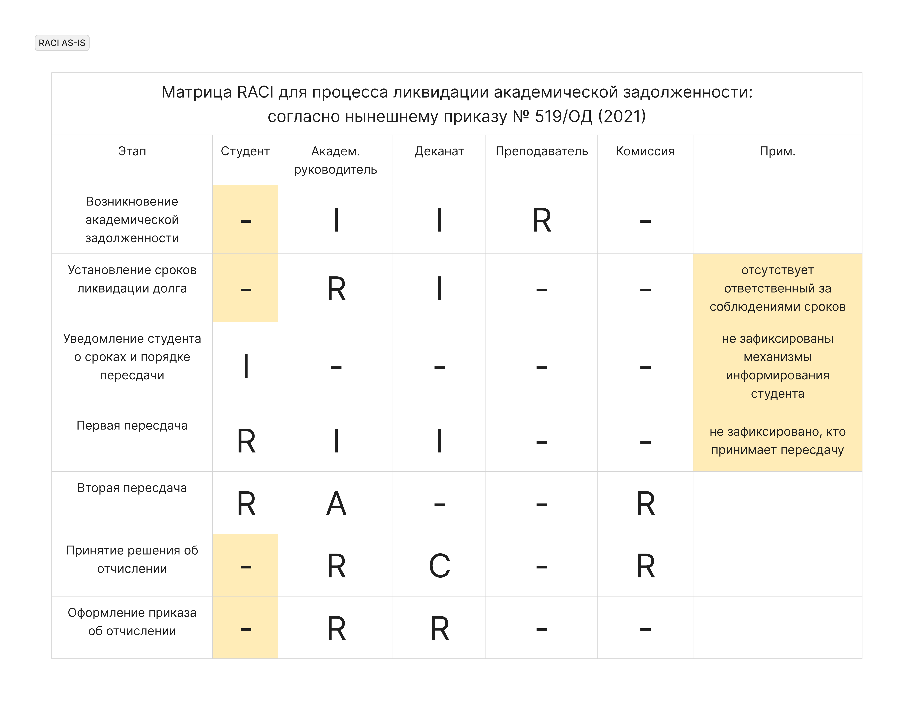
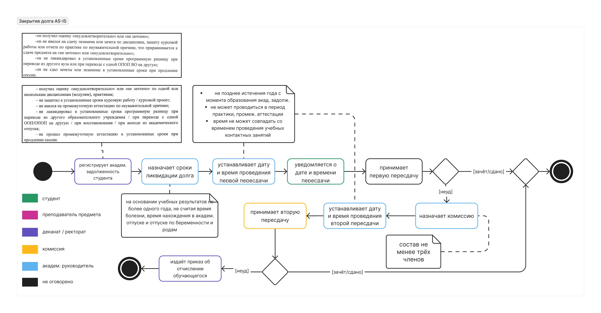
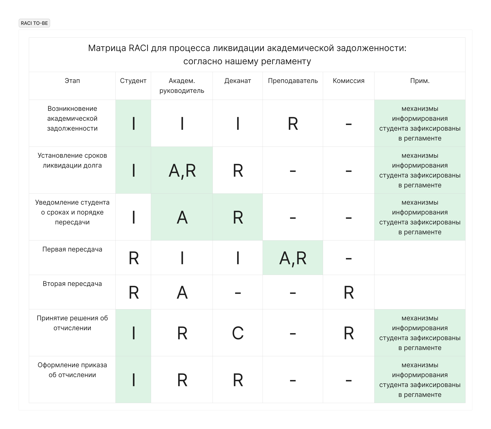
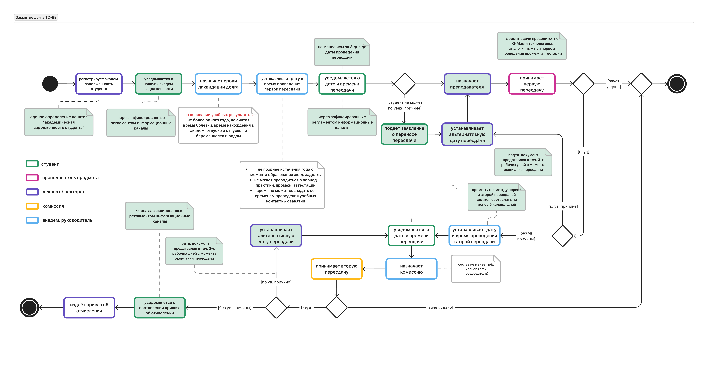

# Оптимизация процесса ликвидации академических задолженностей в ТГУ

## Общая информация
- **Тип проекта:** Междисциплинарный хакатон (системный анализ + юриспруденция)
- **Длительность:** 1 неделя
- **Команда:** 3 студента-аналитика (включая меня) и 3 студента-юриста
- **Соавторы-аналитики:**  
  - [Максим Стариков](https://github.com/MaxStaricov)  
  - *Даниил Иванов*

**Цель:**  
  Упорядочить процесс ликвидации академических задолженностей (пересдач) в Томском государственном университете: устранить противоречия между существующими документами, чётко распределить роли и сроки, сделать процесс прозрачным для студентов и сотрудников.

## Изучение предметной области

Работа началась с анализа нормативной базы:
- **3 основных документа ТГУ** (Положение о текущем контроле 2021, Положение о промежуточной аттестации 2015, Порядок проведения текущего контроля)
- **эталонные документы других вузов** — положения ВШЭ и КФУ, которые уже системно описали процесс пересдач.

Также было проведено **интервью** с 4 студентами, имевшими опыт ликвидации задолженностей в ТГУ.

---

## Исходная ситуация

При вычитке документов были обнаружены множественные проблемы, среди которых:

| Тип проблемы | Пример |
|--------------|--------|
| **Формулировки** | Один и тот же термин «пересдача» в разных документах трактуется по-разному |
| **Отсутствие механизмов** | Не зафиксировано, как именно информируют студента о датах пересдач |
| **Отсутвие управлений** | Нет людей, контролирующих соблюдение сроков ликвидации долга? |
| **Процессные дыры** | Нет описания действий, если преподаватель уволился или не может принимать пересдачу |
| **Игнорирование вариативности** | Документы описывают только экзамены/зачёты, но не курсовые проекты, практики, накопительные системы |

Особенно показательный случай: **срок ликвидации долга** в документах указан «не более года», но на практике встречаются студенты с долгами по 1.5 года без отчисления. Причина — **нет ответственного за соблюдение этого срока**.

## Выбор нотации для моделирования

Мы рассмотрели несколько вариантов представления процесса, но остановились на:

- **Activity diagram** — выбран как основной, потому что позволяет детально отобразить ветвления, события, циклы и временные рамки.
- **RACI-матрица** — дополнительно использована для фиксации ролей (Responsible, Accountable, Consulted, Informed) каждого участника процесса.

> *Итог:* Activity + RACI дали полную картину «как есть» и «как должно быть».

## 4. AS-IS: Как процесс выглядит сейчас

Построили **Activity diagram AS-IS** и **RACI AS-IS**.

**Что не так в AS-IS:**
- hоли не назначены или задвоены
- отсутствуют временные границы (нигде не сказано, через сколько дней после получения долга студент должен быть уведомлён и как).
- нет обратной связи: студент не может инициировать перенос даты пересдачи при конфликте расписаний или по уважительной причине

Мы свели все проблемы в **матрицу процессов и участников**, где для каждого действия из документов указали, кто в нём задействован и какой у него статус. Матрица наглядно показала зоны безответственности.

---

## TO-BE: Целевой процесс

Разработали **Activity diagram TO-BE** и **RACI TO-BE**.

**Принципы изменений:**
- **минимальная инвазивность** — не ломаем сложившийся уклад, а доопределяем недостающие звенья,
- **назначение ответственного** за сроки и механизма контроля,
- **введение обязательных уведомлений** через электронные средства обучения,
- **регламентирование возможности взаимодействовать** студенту и руководству при возникновении нетипичных ситуаций,
- **признание вариативности** пересдач (физкультура, курсовые проекты, практики) — с возможностью для факультетов устанавливать собственные правила пересдач по согласованию с ректором

> Activity-диаграмма TO-BE **не является исчерпывающей** — она показывает логику, но не заменяет юридический текст. Поэтому следующим шагом мы сформулировали требования к регламенту.

---

## Передача требований юристам

Мы определили **список наиболее критичных пробелов** и оформили его в виде **документа «Требования к разработке регламента»** (см. [`requirements_to_lawyers.md`](requirements_to_lawyers.md)).

Этот документ включает в себя информацию:
- чего мы хотим добиться,
- какие конкретные пункты должны появиться в регламенте,
- какие формулировки из существующих документов нужно исправить,
- какие механизмы добавить (уведомления, назначение преподавателя, контроль сроков).

Юристы получили структурированное ТЗ с отсылками к конкретным пунктам исходных актов.

---
## Совместная работа с юристами и итоговый регламент

Юристами на основе наших требований написан **новый регламент ликвидации академических задолженностей** [`final_regulation.pdf`](final_regulation.pdf).

- Процесс стал **прозрачным, измеримым и предсказуемым**.
- После введения данного документа в действие мы ожидаем:
  - значительное снижение количества жалоб студентов на процедуру пересдач,
  - снижение времени урегулирования одного случая,
  - исключение ситуаций, в которых студент не успевал ликвидировать академическую задолженность по незнанию или неуведомленности и был отчислен.