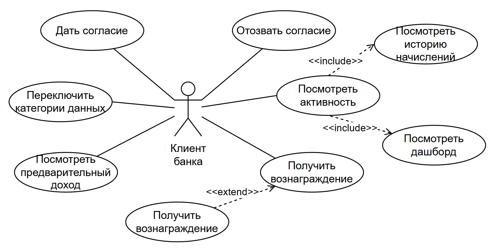
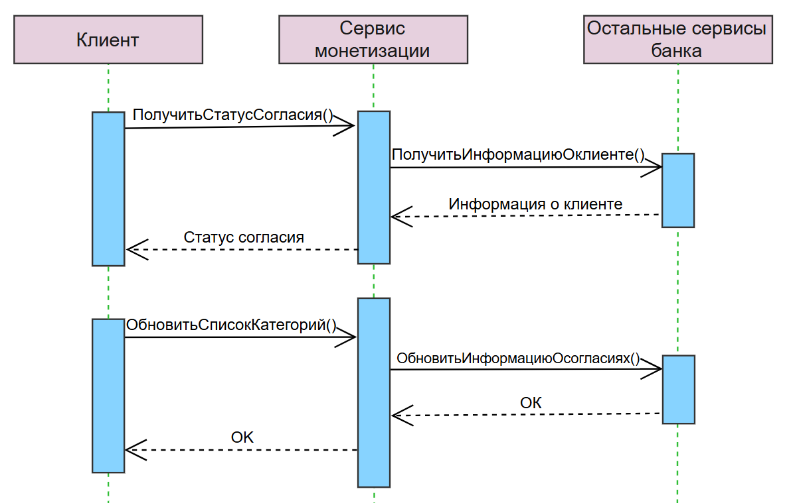
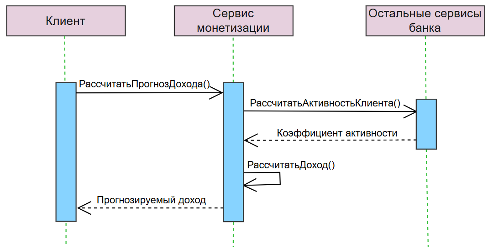
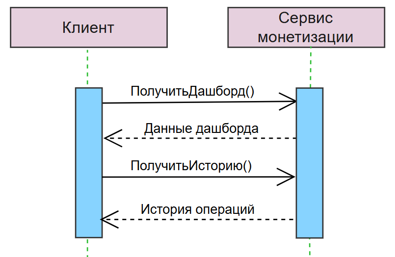
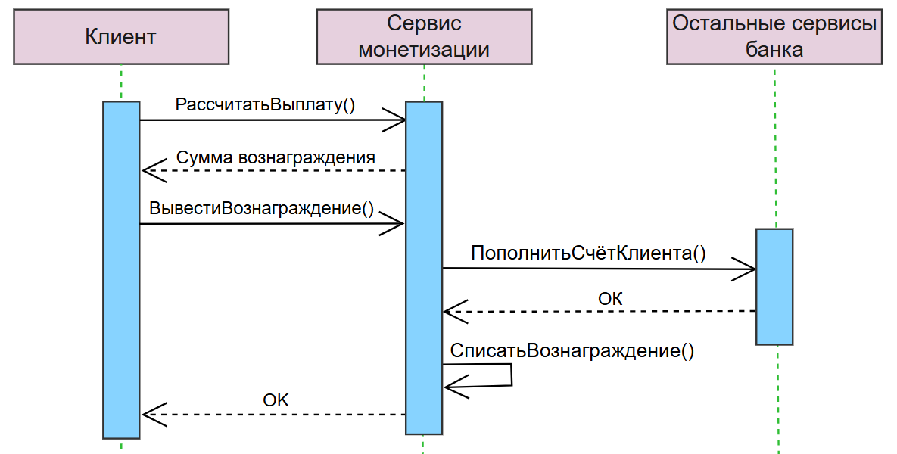
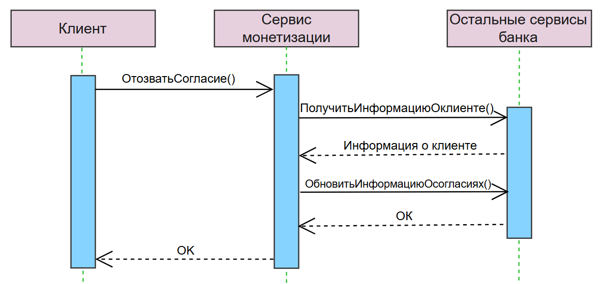
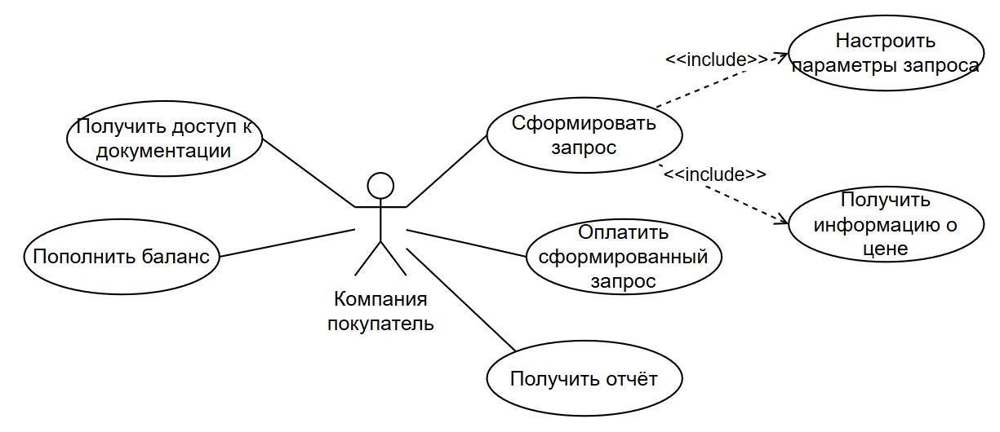
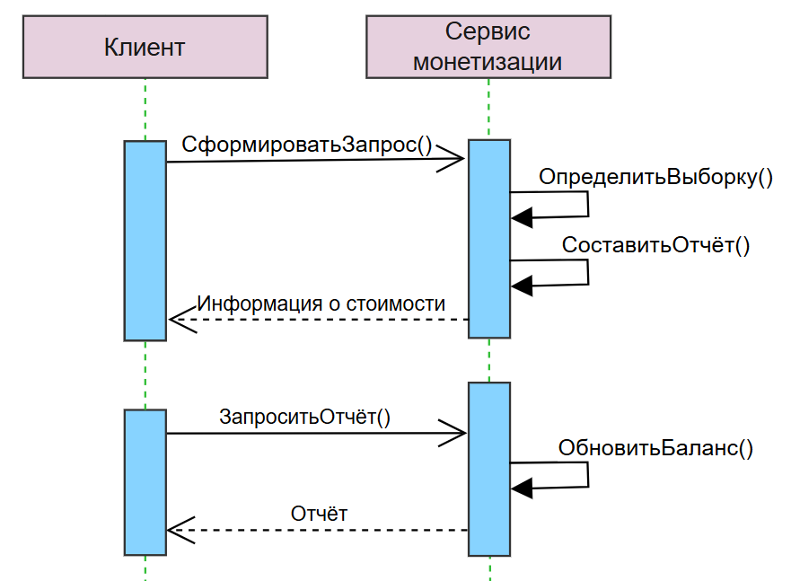
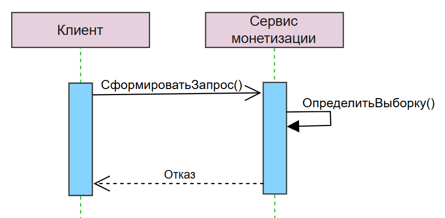

# Платформа монетизации обезличенных данных с согласия клиента

## Общая информация
- **Тип проекта:** кейс-интенсив (от Т-банка и ТПУ)
- **Длительность:** 2 недели
- **Команда:** 2 студента технических специальностей
- **Соавтор:**  
  - [Marat Akhmetshin](https://github.com/makhmetshin)  

**Цель:**  
  Разработать концепцию платформы, которая позволит клиентам банка добровольно и безопасно передавать анонимизированные данные сторонним компаниям за вознаграждение, а сторонним компаниям - анализировать агрегированные данные и выявлять тренды спроса.

## Текущее состояние рынка
Анализ нынешней ситуации показал, что:
- потребители считают, что у них мало контроля над собираемыми данными (87%) и что они имеют право на долю прибыли от монетизации их данных (71%) (согласно [McKinsey «The consumer data opportunity and the privacy imperative»](https://www.mckinsey.com/capabilities/tech-and-ai/our-insights/the-consumer-data-opportunity-and-the-privacy-imperative);
)
- ритейлеры испытывают острую потребность в качественных поведенческих данных: CAC достиг $226.38 в 2024 году;

На российском рынке существуют платформы с монетизацией, однако они преследуют разные цели и не всегда безопасны и интересны пользователям.

Например, **T-Data** и **СберАналитика** предлагают компаниям купить исследования - результат анализа данных пользователей. Данные не передаются напрямую, поэтому получение их отдельного согласия от клиентов и выплата прямого вознаграждения не производятся. С другой стороны, заинтересованным в анализе лицам требуется наладить контакт со службой поддержки платформы, описать требуемую информацию и только спустя время получить ответ, потому что каждый запрос обрабатывается индивидуально. Так, банки монетизируют данные, но не вовлекают клиента в процесс, упуская возможность укрепить доверие и создать новый канал дохода.

**МТС Маркетолог** и **VK Data Platform** используют данные для рекламы: заинтересованные компании выбирают категории пользователей, которые будут получать рекламные рассылки или посты.
 
В России пытались внедрить сервисы, которые предполагают монетизацию данных с выгодой для клиента. В 2024 году была попытка создать **Датаманию** - платформу, на которой пользователи создают профиль и подключают аккаунты, например, из соцсетей, тем самым продавая свой цифровой след. Проект не существует до сих пор, однако его идею можно использовать.

Таким образом, целевая аудитория представлена двумя категориями:
- коммерция, которая характеризуется как: 
    - испытывающая потребность в информации,
    - терпящая высокие риски и накладные расходы,
    - требующая экспертизы в вопросах таргетинга и развития новых продуктов;
- частные лица (пользователи), испытывающие:
    - недоверие к платформам, собирающим данные,
    - непонимание того, что с их данными делают,
    - желание финансовой выгоды со своей цифровой активности.
---

## Концепция платформы
Командой предложен продукт, в котором банк выступает посредником между частными лицами и заинтересованными в данных компаниями и берёт процент за услуги **автоматической передачи и обработки данных**.

Функции продукта рассмотрены со стороны клиента, чьи данные будут использоваться в агрегации, и со стороны компании-покупателя данных.

### Пользователь банка

Со стороны пользователя реализован ряд функций, за счёт которых он может полноценно ознакомиться с продуктом и дать согласие на передачу своих данных.

Также ниже представлены диаграммы последовательностей для различных сценариев использования:

<figure>
  
  <figcaption>1. Дать согласие и настроить категории монетизируемых данных</figcaption>
</figure>

<figure>
  
  <figcaption>2. Рассчитать предварительный доход на основе выбранных категорий данных и активности (покупательской способности) клиента</figcaption>
</figure>

<figure>
  
  <figcaption>3. Просмотреть активность</figcaption>
</figure>

<figure>
  
  <figcaption>4. Вывести вознаграждение</figcaption>
</figure>

<figure>
  
  <figcaption>5. Отозвать согласие</figcaption>
</figure>

Помимо use cases и диаграмм последовательностей были сконструированы [`прототипы основных страниц`](client_screens/REAME.md), с которыми будет взаимодействовать пользователь.

### Покупатель данных

Компания, которой требуются маркетинговые сводки, может составить уникальный запрос. 

В системе предусмотрено 2 вида запроса, пример работы каждого из которых представлен на [`прототипах интерфейса`](company_screens/REAME.md), а также сформулирован в виде API-запросов (см. подробнее [`пример`](api.txt))

> Рекомендуется ознакомиться с прототипом интерфейса, потому что он описывает отчёты, которые могут быть очень полезны маркетологам и аналитикам

Следует обратить внимание, что при несоблюдении k-анонимности (если количество пользователей, подходящих по указанным компании фильтрам слишком мало) компании не будет дан вывод:

<figure>
  
  <figcaption>Запрос с соблюдением k-анонимности</figcaption>
</figure>

<figure>
  
  <figcaption>Запрос, не прошедший проверку k-анонимности</figcaption>
</figure>

## Модель монетизации (допущения)

### Параметры
- `P_base` – цена за одного уникального пользователя в выборке;
- `k` – модификатор за каждый дополнительный фильтр;
- `n` – количество применённых фильтров;
- `S` – размер выборки (после фильтрации, с учётом k-анонимности ≥100);
- комиссия банка за организацию и обработку данных: **30%** от выручки;
- доля пользователей: **50%** от выручки (распределяется пропорционально вкладу в выборку);
- резерв на юридические и технологические риски: **20%** от выручки 

### Формула
Цена для компании = `S × P_base × (k)^n`

### Пример расчёта

**Параметры примера:**
- `P_base` (цена за 1 пользователя в выборке) = 0,50 руб.
- `k` (модификатор за каждый фильтр) = 1,5
- `n` (количество фильтров) = 4
- `S` (размер выборки после фильтрации) = 12 000 пользователей

**Расчёт цены для компании:**
Цена = `S × P_base × (k ^ n) = 12 000 × 0,50 × (1,5 ^ 4) = 30 375 руб.`

**Распределение выручки:**
- банк: `30 375 × 0,30 = 9 112,50 руб.`
- клиенты банка: `30 375 × 0,50 = 15 187,50 руб.` (`15 187,50 / 12 000 ≈ 1,27 руб.` на клиента)
- резерв: `30 375 × 0,20 = 6 075,00 руб.`

## Риски и митигация
| Риск | Вероятность | Влияние | Митигация |
|--------------|--------|--------|----------------|
| **Недостаточное количество пользователей, давших согласие** | средняя | высокое | программа лояльности, изменение параметров и распределение дохода пользователям, продвижение платформы в экосистеме банка |
| **Низкая частота запросов от компаний** | средняя | высокое | запуск пилота с 3–5 якорными компаниями-партнёрами; модель подписки вместо разовых запросов; бесплатные тестовые запросы для первых клиентов |
| **Изменение 152-ФЗ** | средняя | высокое | юридический мониторинг, гибкая архитектура |

## Метрики успеха
- конверсия - % клиентов, согласившихся на монетизацию после ознакомления (целевое значение 10% от всех пользователей банка - примерно 5 млн. человек);
- частота запросов от компаний (от 500 запросов в первый месяц);
- cредний чек запросов;
- NPS пользователей.