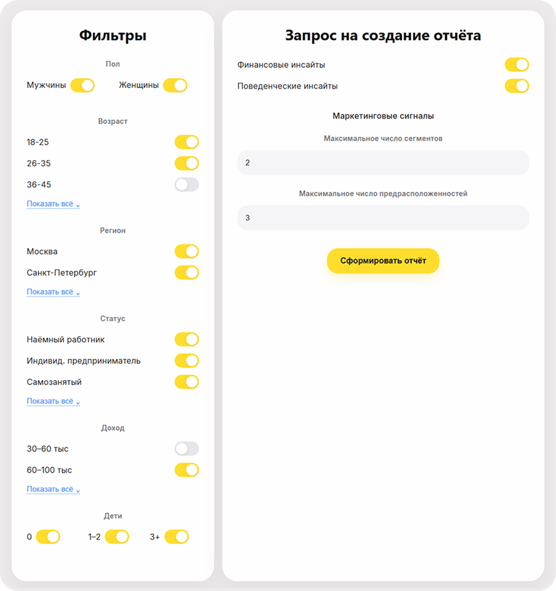
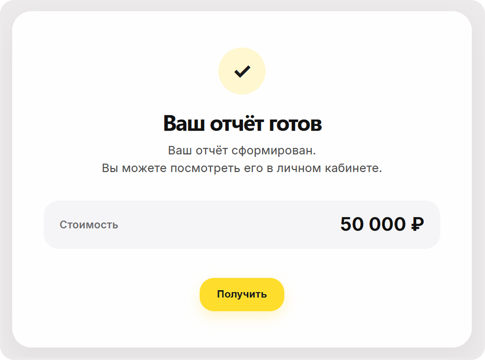
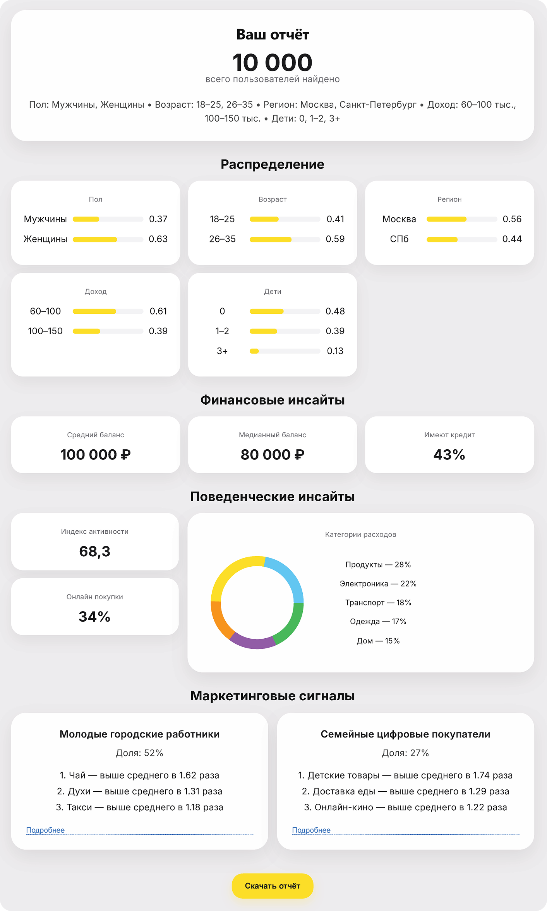
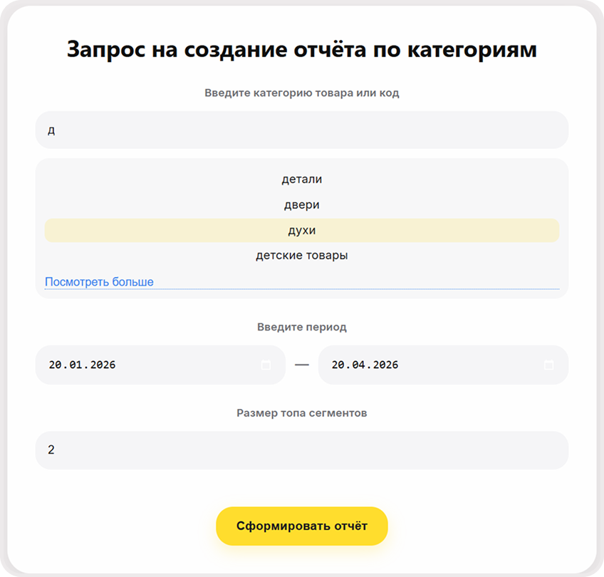
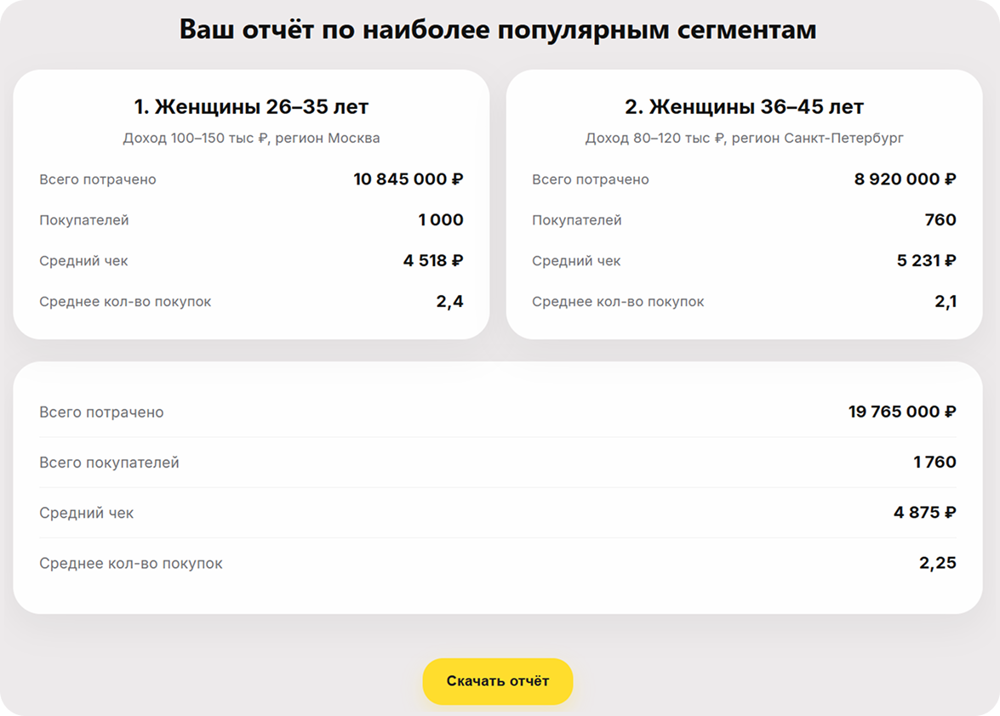

## Компание-покупатель данных

**Первый запрос** подразумевает установку всех фильтров, которые составляют категорию людей интересную исследователю и выбор показателей, которые бы выводились. Помимо указанных в примере фильтров могут быть и другие - фильтры основаны на категориях данных, согласие на передачу которых дал клиент банка.

После запроса пользователю приходит уведомление о том, что отчёт сформирован, с указанием стоимости и количества данных, попавших в выборку (в случае если соблюдена k-анонимность)

Если пользователь сочтёт нужным купить такой отчёт, он получит сводку, которую впоследствии сможет исследовать. Наиболее интересной категорией для анализа предоставляются маркетинговые сигналы: после кластеризации данных, попавших в выборку, выводятся наиболее частые "портреты" людей и их предпочтения.

**Второй запрос** предполагает введение категории товара, по которому исследователь хотел бы просмотреть "портреты" людей, его покупающих.

После уведомления о том, что отчёт сформирован, и его оплаты пользователь получает интересующую его сводку. Предполагается, что система отфильтровывает клиентов, покупавших товар в указанный промежуток времени, и затем их кластеризует по возрасту, доходу и региону проживания. После этого группы сортируются в порядке убывания числа участников и отбираются первые n, указанные покупателем данных.

