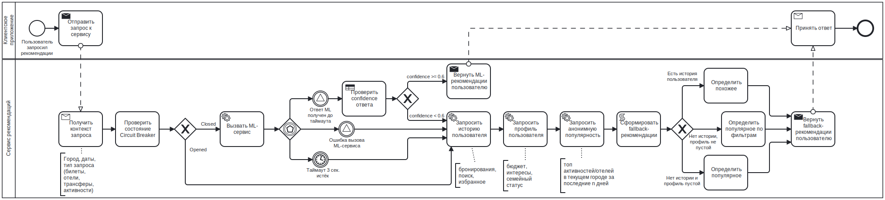

# TravelTech: резервный сценарий для ML-рекомендаций

## Общая информация
- **Тип проекта:** Кейс от Т-банка
- **Длительность:** 1 неделя

---

**Задача:**  
  Сервис планирования путешествий использует ML-модель для персонализированных рекомендаций (отели, активности, маршруты). 
  При отказе ML-сервиса, задержке ответа более 3 секунд или низкой уверенности модели (confidence < 0.6) необходимо разработать резервный сценарий, который:
- обеспечит непрерывность пользовательского опыта (UX)
- использует только внутренние данные (история бронирований, профиль пользователя, анонимная популярность)
- поддержит плавное переключение между основным и резервным режимами
- не кэширует предсказания ML (интересы быстро устаревают).

---

## Решение

Решение построено вокруг обработки одного запроса пользователя и управления поведением системы при серийных сбоях на различных уровнях абстракции.

**BPMN** использован для создания каркаса процесса для каждого отдельного запроса. В случае сбоя каждый из запросов проходит путь по fallback-ветке, так что пользователь не узнаёт об ошибке и получает ответ в любом случае:

Для регулирования длительной недоступности ML-сервиса был использован паттерн **Circuit Breaker**.  В состоянии Closed каждый запрос либо успешно использует ML, либо немедленно переключается на fallback для этого конкретного запроса. Накопление ошибок влияет только на переход в состояние Open, после которого ML вообще не вызывается для всех пользователей до истечения времени восстановления. Через 30 секунд в Open система переходит в Half-Open, выполняет один пробный вызов ML и при успехе возвращается в Closed:

Таким образом, ни один пользователь не ожидает накопления ошибок - fallback применяется мгновенно при любом сбое, а Circuit Breaker поможет оптимизировать поведение системы при массовых отказах сервиса.

**Sequence Diagram** детализирует взаимодействие компонентов во времени для двух сценариев. Эта диаграмма создана с целью конкретизировать, как именно в BPMN-задачах "Вызвать ML-сервис" и "Сформировать fallback-рекомендации" происходят обмены, где обрывается таймаут и где проверяется confidence.

Успешное взаимодействие (ML-сервис дал ответ вовремя и без ошибок, confidence выше границы):

Взаимодействие в ситуации, когда ML-сервис дал сбой или предсказание неточное, а Circuit Breaker закрыт (случай, когда он открыт, куда проще: запрос сразу переводится к Fallback Engine):

Предполагается, что формат ответа и для базового, и для резервного сценария одинаков (структура JSON будет содержать поле source (ml или fallback), массив рекомендаций и мета-информацию (например время ответа, причина переключения на fallback)).
Это обеспечивает клиенту независимость от источника рекомендаций.

Внутренняя логика Fallback Engine раскрывается через **таблицу решений** (приоритет истории, затем профиль, затем анонимная популярность):

В **таблице нефункциональных требований** зафиксированы все количественные параметры (c их возможными значениями), использующиеся при построении решения:

Ожидается, что переключение между ML и fallback будет проходить незаметно благодаря единому формату ответа. Circuit Breaker защищает систему от каскадных отказов и автоматически восстанавливается.  В совокупности представленные артефакты дают непротиворечивое описание резервного сценария.

---
## Итоги

- непрерывность UX – пользователь всегда получает ответ ≤3 с (ML или fallback), ошибка не отображается;
- только внутренние данные – fallback использует историю, профиль, популярность; кэш предсказаний ML не применяется;
- плавное переключение – Circuit Breaker с состояниями Closed/Open/Half-Open, накопление ошибок и автоматическое восстановление паттерна;
- отсутствие кэширования предсказаний.