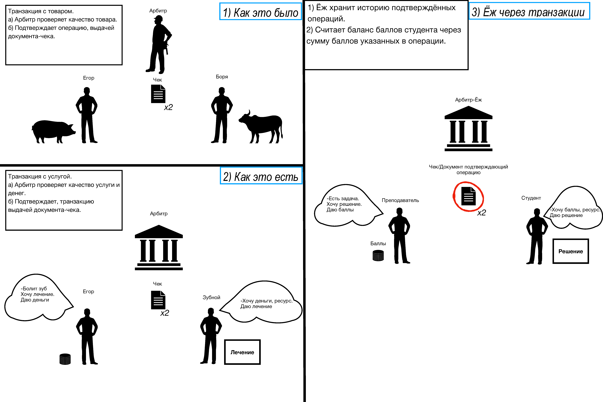

# LMS Transactional Process Model (IDEF0)

## Общая информация
- **Тип проекта:** учебный

Данный проект представляет собой формализацию работы LMS-системы **CodeHedgehog** в виде функциональной модели с использованием нотации **IDEF0**. 
Основной фокус — выделение функций системы, потоков управления и взаимодействий между процессами, не умаляя внимания на бизнес-функциях платформы.

**Цель:** 
Описать систему через транзакционный подход без использования объектных моделей и выделить ключевые функции обработки запросов пользователя

---

## Решение

Использована нотация **IDEF0**, позволяющая детализировать процессы от общего обзора до конкретных операций с помощью функциональных блоков.

В рамках проекта выполнена функциональная декомпозиция LMS. Так как итоговый набор артефактов был получен итеративным путём, в данном разделе сформулирован процесс мышления, к нему приведший, с промежуточными вариантамами IDEF0-диаграмм. 

> Если вам интересно оценить последнюю версию системы, можете сразу перейти к [этому абзацу](#итоговое-видение-системы).

### Первоначальное видение системы

Первая версия модели строилась на интуитивном понимании работы платформы **CodeHedgehog**, так как именно она используется студентами специальности "Программная инженерия" ТГУ.

**Базовый сценарий с точки зрения студента**:
Студент заходит на платформу на выбранный курс, где выбирает из набора задач какую-то одну, отправляет её решение и, если код-решение прошёл автоматическую проверку (и дополнительную проверку преподавателя или ассистента в некоторых случаях), получает количество баллов, равное стоимости данной задачи.
Повторяя данный процесс, он "накапливает счёт" (набирает баллы), благодаря чему продвигается в рейтинге среди других таких же студентов и, рассуждая глобально, повышает уровень собственных знаний.

Параллель с банковскими системами и представление обучающей платформы через транзакции была проведена следующим образом:

Данное представление послужило основой создания первой версии контекстной диаграммы и диаграммы первого (нулевого) уровня, где транзакции были представлены в виде потоков данных (конкретно, выходов блока Проверить решение) и назывались подобным образом: "Начисление баллов за решение", "Снятие баллов за решение".

Последующие размышления о системе заставили прийти к выводам, что непосредственно **баллы** в системе были задуманы для облегчения взаимодействия с ней студенту (баллы - подобие валюты) и на самом деле являются производной **вердиктов** по каждому из решений.

Рассмотрение процесса с данной точки зрения позволяет назвать транзакцией именно вердикт (фиксацию системой успешно решённого задания или, напротив, фиксация того, что задание решено неверно), а баллы и "счёт" студента легко бы вычислялись на основе журнала таких транзакций.

Поэтому контекстная диаграмма верхнего уровня имеет следующий вид:

В результате декомпозиции процесс представляется следующим образом, где "Установить вердикт" выступает одним из ключевых функциональных блоков системы:

В данном представлении студент (в отличие от преподавателей и ассистентов, которые выступают механизмами процессов) является входом в функциональный блок - с исходным уровнем знаний, и, по результату выполнения контекстного блока Обучить студента, выходом - с новым, подтверждённым журналом транзакций, уровнем знаний.

Первоначальное видение системы **имеет ряд недочётов**:
- содержательно неоднородные блоки на диаграмме A0: например, блок А2 "Записать студента на курс" фактически является вполне конкретной небольшой функцией в сравнении с блоком A3 "Осуществить учебную деятельность";
- управлениями в системе выступают абстрактные "Правила предмета", но LMS-система должна быть вне контекста предмета, так как работает не по его правилам;
- логическое несоответствие входов и выходов блока "Осуществить учебную деятельность": в блок поступает студент с доступом к заданиям, но выходит уже не студент, а решение студента (и уже в единственном числе);
- процессы "Осуществить учебную деятельность" и "Установить вердикт" разделены на схеме, однако на самом деле с данной формулировкой второй блок должен семантически являться частью первого.

### Промежуточное видение системы

После ознакомления с [работой](https://vital.lib.tsu.ru/vital/%20access/manager/Repository/vital:14368) "Разработка высокоуровневой архитектуры цифровой платформы "CodeHedgehog"" А.А.Куприянова было выявлено несоответствие уровня абстракции. В работе главным бизнес-процессом системы назван процесс "Решить задачу", а также подробно описан (хоть и на уровне архитектуры) процесс автоматической установки вердикта решению и дальнейшей корректировки вердикта преподавателем.

По этой причине была создана следующая версия контекстного функционального блока, который назван "Организовать решение задачи" и уже менее явно описывает главную функцию LMS - автоматизацию обучения, но формально более близка к видению автора работы:

В результате декомпозиции получено:

И также подробнее рассмотрен блок A4 "Установить вердикт" - он представляет больший интерес, так как вердикт в системе уже ранее был назван транзакцией:

Несмотря на то что данная версия больше приближена к архитектуре платформы CodeHedgehog, она также имеет **оказавшимися критичными тонкости**:
- студент выступает механизмом платформы, а значит обучающая функция LMS-системы теперь не рассмотрена совсем;
- возникают трудности с формулировками: блок "Подготовить задачи" имеет выход "Готовая задача", блок "Дать доступ к задачам" - "Доступная задача" - числа существительных в названиях блоков и потоках данных несогласованы, а их приведение в какую-то одну форму (мн. или ед. число) порождало бы семантические проблемы;
- формулировка каждого из блоков диаграммы A0 не подразумевает под собой цикличность процессов, поэтому, например, можно счесть, что функция "Подготовить задачи" выполняется один раз за всё время решения задачи и её редактирование невозможно при переходе к блокам A2-A4, так как задачи "подготавливаются" единоразово;
- формулировка блока A2 "Дать доступ к задачам" не раскрывает набор процессов в неё входящих в полной мере (создание класса с добавлением задач в данный класс, присоединение студента к курсу), в том числе неясно, кому этот доступ будет дан, так как теперь студент - механизм процесса.

### Итоговое видение системы

В результате работы над прошлыми версиями и всеми их преимуществами и недостатками была выведена итоговая IDEF0-диаграмма, которая учитывает и основную бизнес-функцию любой LMS-системы - автоматизация обучения (в случае CodeHedgehog - обучения студента), и концептуальную функцию, использованную при разработке архитектуры CodeHedgehog.

**Артефакты будут прикреплены позднее**

---

## Вывод

Модель демонстрирует системный подход к анализу LMS через декомпозицию транзакционных процессов и позволяет рассматривать систему как набор взаимосвязанных функций, а не объектов.