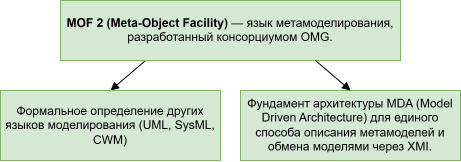
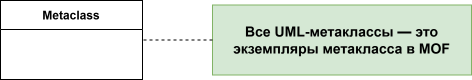

# Анализ предметной области Meta-Object Facility 2

В настоящем документе рассмотрены контекст и предпосылки появления Meta-Object Facility 2, его концептуальное описание (согласно официальной спецификации Object Managment Group MOF2), а также оценка действенности данного средства с точки зрения изначально поставленных создателями задач.

## Содержание

1. [История появления и проблематика](#история-появления-и-проблематика)
2. [Пакетное представление MOF2](#пакетное-представление-mof2)
3. [Целесообразность разделения на EMOF и CMOF](#целесообразность-разделения-на-emof-и-cmof)
4. [Метаклассы CMOF](#метаклассы-cmof)
5. [Проблема повторного использования метаклассов](#проблема-повторного-использования-метаклассов)

## История появления и проблематика

**Meta-Object Facility 2** - средство для мета-моделирования объектов - разработано Object Managment Group в 1997 году.
Зародилось оно не случайно и его появлению поспособствовал ряд предпосылок:

- каждое средство моделирования использовало свой внутренний формат хранения моделей. Обмен моделями между разными инструментами был практически невозможен, так как все они работают с семантически одними и теми же моделями (классы, атрибуты, связи), но хранят их в своих внутренних форматах.
- при создании нового предметно-ориентированного языка (DSL) приходилось придумывать с нуля его синтаксис, семантику, формат хранения, инструменты.
- модели не обладали рефлексией - способностью программно исследовать и изменять свою структуру во время выполнения. Отсутствало стандартное API, с помощью которого можно было бы узнать, сколько у модели классов и какие у них атрибуты.

В 1991 году был OMG создала фундаментальный стандарт **CORBA (Common Object Request Broker Architecture)**. Он разрешал первую проблему - проблему разнородного формата хранения моделей: если программа хочет что-то получить от другой программы, она отправляет запрос через "брокера" (ORB), который находит нужный объект и передает ответ обратно. 

Этот подход, основанный на моделировании объектов, привел OMG к созданию нового универсального инструмента в 1997 году — **UML (Unified Modeling Language)**. UML стал стандартным визуальным языком для "черчения" чертежей программных систем и был призван заменить множество разрозненных нотаций.

Так как ожидалось, что появление UML повлечет за собой создание новых языков, острее возникла необходимость сформулировать язык для описания других языков моделирования. К тому же в CORBA для работы с объектами в распределённых системах нужна была единая система типов. Поэтому практически одновременно с UML 1.1 принимается и **MOF 1.1**.

Изначально цель MOF была довольно глобальная - помимо приведения к единой форме инструментов и форматов модели и упрощения создания новых языков моделирования, они хотели использовать рефлексию для создания инструментов, преобразовывающих диаграммы в код.

Так в 2000 году появилась наиболее успешная, и к сожалению единственная реализация этой идеи - Eclipse Modeling Framework (EMF): берется модель (диаграмма классов), и на её основе генерируется Java-код.

## Пакетное представление MOF2

Согласно словам самих создателей, *"стандарт основан на упрощении возможностей моделирования классов в UML2. В дополнение к предоставлению средств для определения метамодели, он добавляет основные возможности для управления моделью в целом, включая идентификаторы, простые универсальные теги и отражающие операции, которые определены в общем виде и могут применяться независимо от метамодели. Ядро MOF2 построено на основе других спецификаций OMG MOF"*.

Метамодель MOF2 можно представить как расширение ряда указанных ниже на диаграмме пакетов с некоторыми наложенными на них ограничениями.

> Фактически, MOF2 переиспользует определения, данные в метамодели UML - например, в отличие от UML, в MOF ассоциации могут иметь только два конца (n-арные запрещены).

Рассмотреть подробнее описание каждого из пакетов и обоснование их включения в MOF можно в файле [`package_dependencies.md`](package_dependencies.md).

## Целесообразность разделения на EMOF и CMOF

MOF имеет два уровня соответствия: **EMOF (Essential MOF)** и **CMOF (Complete MOF)**, которые решают различные задачи метамоделирования.

EMOF создан как минимальное ядро для быстрых реализаций и простых DSL, CMOF – полная версия для описания сложных метамоделей (UML, SysML) и метацикличности (фактически является EMOF с дополнительными возможностями, выраженными пакетами MOF::CMOFExtension и MOF::CMOFReflection).
    

## Метаклассы CMOF

CMOF в отличие от EMOF обладает максимальной выразительной силой и используется для описания самого себя и UML, поэтому далее рассмотрены основные метаклассы именно этого уровня MOF.

В пакетах MOF появляются новые метаклассы, которых нет в стандартном UML:
- из пакета рефлексия: добавляет `Element`, `Object`, `Factory`.
- из пакета идентификаторы: добавляет `Extent`, `URIExtent`.
- такие расширения как (**`MOF::Extension`**) добавляет `Tag` (пара имя-значение).
- коллекции: добавляет `ReflectiveCollection`, `ReflectiveSequence` (интерфейсы для работы с коллекциями).
- рефлексию CMOF: добавляет `Link` (экземпляр ассоциации) и `Argument`, а также расширяет операции `Object`, `Factory`, `Extent`.

Одновременно MOF накладывает ограничения на существующие метаклассы UML с целью сузить их поведение до нужного для метамоделирования. 

Для того чтобы не углубляться в перечисление конкретных метаклассов CMOF из пакета UML (тем не менее с ними можно ознакомиться в файле [`metaclasses.md`](metaclasses.md)), рассмотрим их в виде пяти интерфейсов, выражающих их свойства, и четырёх конкретных классов (`Operation`, `Generalization`, `Constraint` и `OpaqueExpression`)

> Такие абстракции отсутствуют в оригинальной спецификации CMOF, однако, чтобы не перечислять каждый допустимый класс в CMOF по отдельности, она была введена для ознакомления с метаклассами

## Проблема повторного использования метаклассов

Изначально (1996-2001 год) MOF зародился как тень UML (внутренний каркас UML для формального описания и хранения моделей), начиная с 2003 года всё так же проектировался вместе с UML, но уже имел собственную архитектуру, переиспользуя общее ядро из UML 2.0.

Идея MOF и всей экосистемы MDA была амбициозной: считалось, что если объединить метамодель и язык для описания моделей, можно будет создавать полноценные, работающие приложения из диаграмм. Для её воплощения в MOF и были внедрены большинство пакетов, в особенности рефлекия, а также наложены ограничения на определённые в UML метаклассы. 

С 2012 произошло слияние метамоделей, то есть с MOF 2.4 создатели спецификации заявили, что MOF и UML начали использовать общую метамодель. Это означает, что метаклассы UML перестали быть отдельными сущностями — они стали экземплярами CMOF-метаклассов.
Однако вместе с этим они отступили от первоначальной цели: MOF превратился в инструмент для описания самого себя и UML и основная ценность MOF сместилась в сторону формальной строгости, а не практической ценности.

Для подтверждения этой точки зрения можно рассмотреть **метамодель UML, выраженную языком UML**:

В свою очередь **в представлении UML через MOF** каждый элемент из диаграммы выше - это экземпляр соответствующего метакласса CMOF. Так можно построить множество соответствий, согласно которым **метамодель UML, выраженная языком CMOF** идейно такая же:
- UML::Classifier - это экземпляр CMOF::Class
- UML::Property - это экземпляр CMOF::Property
- UML::Association - это экземпляр CMOF::Association
- UML::DataType - это экземпляр CMOF::DataType
- UML::Generalization - это экземпляр CMOF::Generalization.

Именно поэтому современный MOF может восприниматься как "спецификация ради спецификации": фактически никаких новых возможностей использование пакетов теперь не добавляет.

Кроме того, если переходить на ещё более высокий уровень абстракции, такими же темпами можно представить метамодель UML через MOF на ещё более высоком уровне абстракции, просто как `Metaclass` (каждый из классов метамодели UML через UML - экземпляр абстрактного класса):

MOF задумывался как фундамент для модельно-ориентированной разработки, который должен был превращать диаграммы в код и унифицировать инструменты. Однако на практике эта идея провалилась.

Генерация кода работает только для структурных моделей (диаграммы классов) — и то с трудом. Поведенческие диаграммы так и не удалось перевести в работающий код. Вместо того чтобы решать реальные задачи разработчиков, MOF погрузился в бесконечное самоописание: его главное достижение — это формальное описание самого себя и UML.

По сути, с 2012 года MOF стал памятником самому себе: сложным и бесполезным для реальной разработки. Его ценность исключительно академическая: он показывает, как можно формально описать язык. Разработчики используют Ecore (основанный на идеях EMOF), а не CMOF. Обещанная революция MDA не случилась.
