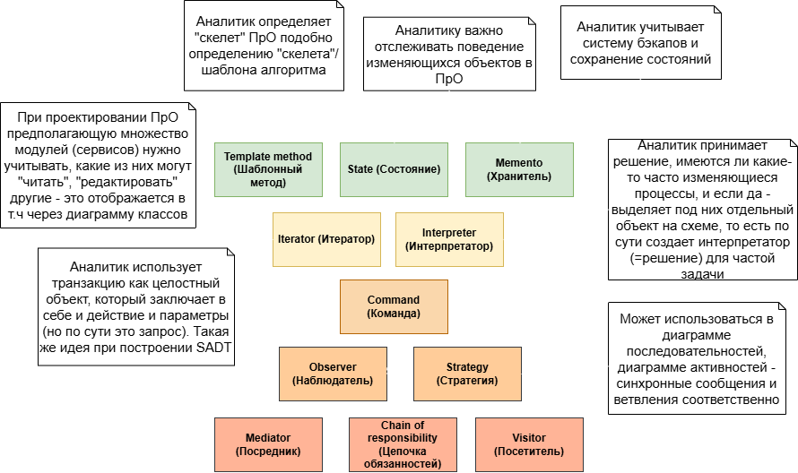

# Дополнительные артефакты

В этой папке собраны небольшие самостоятельные работы (зачастую выполненных в рамках учебных работ), которые не вошли в основные кейсы, но демонстрируют мои знания в смежных областях.

## Поведенческие паттерны проектирования для аналитика

Схема с ранжированием **поведенческих паттернов** по степени полезности для системного аналитика, с пояснениями, как их можно адаптировать под зажачи анализа требований и моделирования.

