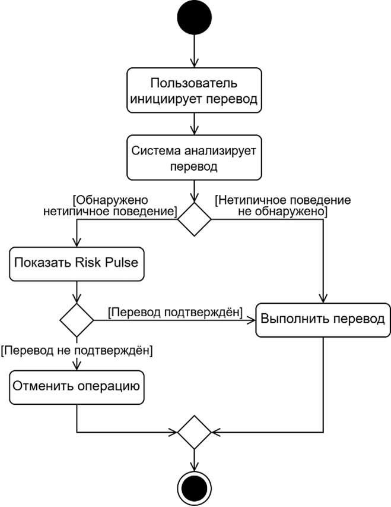
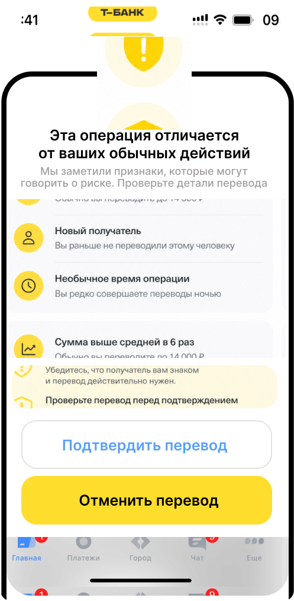

# Автоматизация чат-бота поддержки 

## Общая информация
- **Тип проекта:** кейс от Т-банка

Новая функция для приложения финансового здоровья, соответствующая критериям, указанным в [`задаче`](task.md).

## Описание функции

**Risk Pulse** – функция фоновой оценки нетипичных финансовых операций, которая помогает пользователю заметить риск до подтверждения перевода.

> Risk Pulse работает в фоновом режиме и сравнивает каждую финансовую операцию с привычным финансовым поведением пользователя.

Перед выполнением перевода система формирует персональный Risk score на основе суммы, получателя, времени, устройства, истории предыдущих действий.
Если операция соответствует обычному поведению, функция остаётся полностью незаметной для пользователя. Если система фиксирует существенное отклонение, приложение показывает краткое предупреждение с объяснением причины, не блокируя действие.
Это даёт пользователю возможность остановиться и перепроверить действие до списания средств.

<td></td>

Для работы функции необходимы:
- поведенческие данные (частота операций, средняя сумма, типы расходов);
- контекстные данные (время, устройство, география);
- исторические данные (доверенные получатели, предыдущие подтверждённые рисковые действия).

## Возможный сценарий                              

Пользователь 25 лет регулярно переводит друзьям небольшие суммы днём. Поздно ночью он пытается перевести 85 000 ₽ новому получателю.

Система определяет отклонение: сумма значительно выше обычной, получатель новый и операция совершается в нетипичное время. Система фиксирует высокий уровень риска. Приложение показывает предупреждение Risk Pulse. Пользователь перепроверяет реквизиты и отменяет перевод.

<td></td>

## Ожидаемый эффект

Risk Pulse влияет на продукт сразу в трёх направлениях:
| Пользователь | Бизнес | Продукт |
|--------------|--------|---------|
| повышает ощущение контроля над операциями | уменьшает fraud loss | повышает лояльность пользователей |
| снижает вероятность ошибки | снижает нагрузку на поддержку | формирует восприятие приложения как помощника, а не контролёра |

## Оценка эффективности

Эффективность функции можно оценивать по доле отменённых рискованных операций, снижению мошеннических переводов, снижению обращений в поддержку, количеству ложных срабатываний и изменению NPS у пользователей.
Ценность функции можно подтвердить через A/B тестирование. Одна группа пользователей использует приложение без Risk Pulse, другая – с включённой функцией. Сравниваются:
- число ошибочных операций;
- количество обращений;
- удовлетворённость пользователей.
Если функция снижает финансовые ошибки без роста раздражения, её ценность подтверждается данными.
