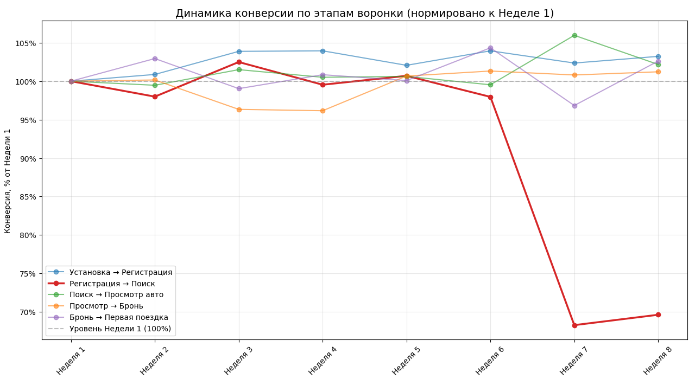

# Анализ проблемы: Конверсия пользователей с первого входа в приложение до первой поездки упала на 15% за последние 2 месяца.

## Общая информация

Известно, что конверсия пользователей с первого входа в приложение до первой поездки упала на 15% за последние 2 месяца. Необходимо проанализировать [данные](data.csv) за последние 8 недель, визуализировать их и описать проблему и гипотезы для её решения.

## Решение

После детального рассмотрения данных были замечены резкие изменения в абсолютных числах в последних неделях (7 и 8).
Для корректной визуализации был написан [код](product_analusis.py) с использованием библиотек `matplotlib` и `pandas`. Данные были агрегированы по неделям, далее были рассчитаны конверсии между этапами воронки и нормированы относительно значения на 1-й неделе

В результате был получен график:

### Описание проблемы

Конверсия из установки в первую поездку снизилась на 15% за последние два месяца. Анализ воронки по неделям показывает, что падение сконцентрировано на этапе «Регистрация → Открытие поиска». Начиная с 7-й недели пользователи после регистрации значительно реже доходят до поиска автомобилей. Остальные шаги воронки стабильны.

Основные потери происходят при переходе от регистрации к поиску. Если рассматривать уровень конверсии за первую неделю как 100%, то к восьмой неделе она стала ниже 70%. Основная доля потерь конверсии концентрируется на этапе «Регистрация → Открытие поиска», что делает его ключевым драйвером общего падения.

### Гипотезы по увеличению конверсии

Наиболее вероятная причина связана с изменениями в продукте поиска, так как он был единственным значимым обновлением в этот период:

- изменения в интерфейсе поиска могли снизить его заметность или ухудшить UX после регистрации;
- возможное появление дополнительного шага, который блокирует переход к поиску.
Дальнейшие действия:
- проверить логи переходов после регистрации (drop-off на экране поиска) и время до первого открытия поиска;
- провести A/B-тест с откатом изменений поиска для части новых пользователей;
- сегментировать по устройствам/ОС (возможно баг проявляется только на одной платформе) и геолокации;
- записать пользовательские сессии после регистрации, чтобы увидеть реальное поведение приложения.